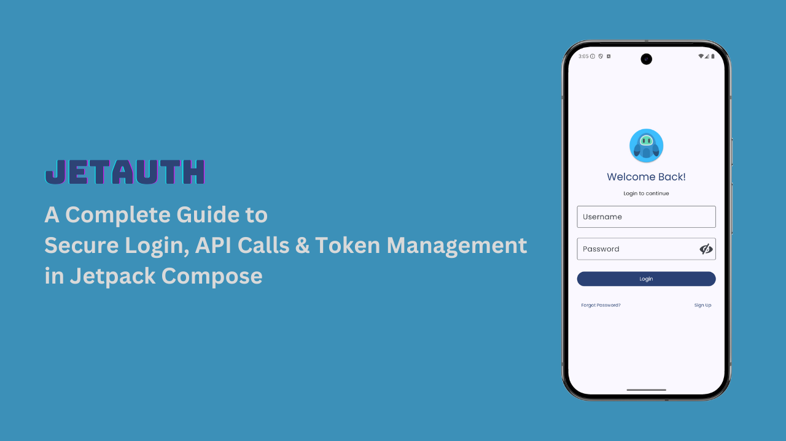
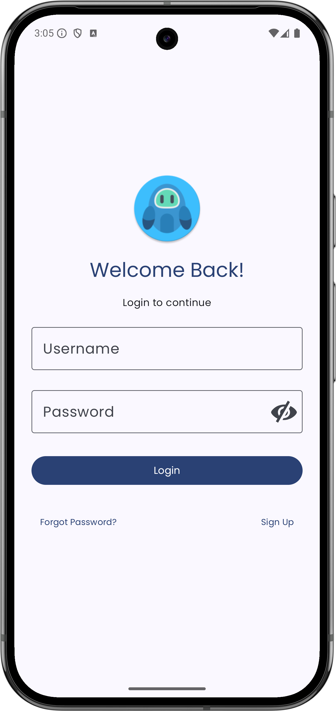
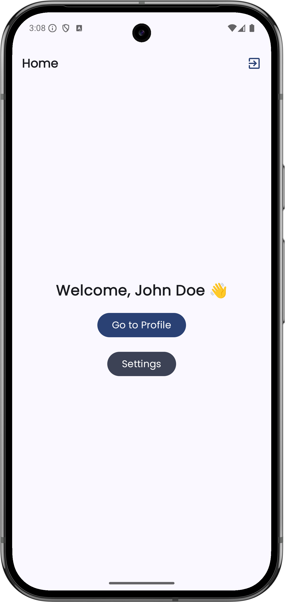

# JetAuth: A Complete Guide to Secure Login, API Calls & Token Management in Jetpack Compose

JetAuth is a **modern Android authentication app** built using **Jetpack Compose** and **Kotlin**.  
It provides a **secure and scalable login system** by following **MVVM + Clean Architecture**
principles.

## 🚀 Key Technologies Used

- ✅ **Jetpack Compose** – Modern UI toolkit for building beautiful and reactive UI.
- ✅ **Ktor Client** – Lightweight and efficient networking for API calls.
- ✅ **Jetpack Compose Navigation** – Manages screen transitions seamlessly.
- ✅ **Kotlin Serialization** – Simplifies JSON parsing for API responses.
- ✅ **Hilt (Dependency Injection)** – Ensures modularity and easy testing.
- ✅ **ViewModel + StateFlow** – Manages UI state efficiently.
- ✅ **DataStore** – Stores authentication tokens securely.

## 📖 About This Tutorial

This **Android Login Tutorial** will guide you step by step in **building a complete authentication
system** with:

- ✅ Secure API calls using **Ktor Client**
- ✅ **Token storage** and **automatic refresh logic**
- ✅ **MVVM + Clean Architecture** for better maintainability
- ✅ **Dependency Injection with Hilt**
- ✅ **State management using ViewModel & StateFlow**

---

## Demo


## 📦 Installation

### Requirements

Before you begin, make sure you have the following:

- **Android Studio Meerkat | 2024.3.1** or greater.
- **AGP (Android Gradle Plugin)**: Version **8.9.0** or greater.
- **Kotlin**: Version **2.1.10** or greater.
- **SDK Version**: Android **5.0 (API level 21)** or higher.

### Steps to Install

1. **Clone the repository**:
   ```bash
   git clone https://github.com/probelalkhan/JetAuth.git
   ```
2. Open the project in Android Studio.
3. Build and run the project
   If you want to run the app on an emulator or real device, just click the Run button in Android
   Studio.

## 🔌 API Integration

This project uses the mock API service provided by **[DummyJSON](https://dummyjson.com/)**. You can
refer to the **[DummyJSON API documentation](https://dummyjson.com/docs)** for more details on
available endpoints and request formats.

### Base URL Configuration

The **base URL** for the API is defined in the app-level **`build.gradle`** file. Below is the
configuration used for both the **debug** and **release** build types:

```kotlin
android {
    buildTypes {
        debug {
            isMinifyEnabled = false
            buildConfigField("String", "BASE_URL", "\"dummyjson.com\"")
        }
        release {
            isMinifyEnabled = true
            proguardFiles(
                getDefaultProguardFile("proguard-android-optimize.txt"),
                "proguard-rules.pro",
            )
            buildConfigField("String", "BASE_URL", "\"dummyjson.com\"")
        }
    }
}
```

## 📸 Screenshots

Once logged in, users are taken to the home screen.
<div>
  
  
</div>

## 📝 License

This project is licensed under the **MIT License**. You can freely use, modify, and distribute the code. For more details, check the [MIT License](https://opensource.org/licenses/MIT).


## 🤝 Help & Support

If you encounter any issues or need help with anything, please check the following:

Issues: Look through the issues section to see if your question has already been answered.
Documentation: Make sure to read through the README for detailed instructions on setting up and
using the app.
Community: Ask questions or share feedback by opening a new issue or participating in the
discussion.

## 🌟 Support the Project

If you find this Android Login Tutorial helpful, please consider starring the repository to show
your support! ⭐ It helps others find the project and encourages the community to contribute.

